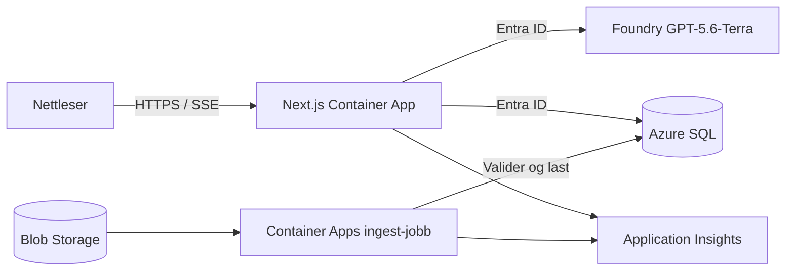

# Norautron Analytics

En chat- og rapportløsning for de syntetiske dataene i
`Norautron_syntetiske_data.xlsx`. Applikasjonen analyserer fem sammenhengende
datakilder:

- produksjon;
- ERP-salg;
- CRM-pipeline;
- kvalitet;
- forsyning og logistikk.

Alle data er syntetiske og skal kun brukes til demo, utvikling og test.

## Funksjoner

- Chat på norsk over verifiserte SQL-resultater.
- SELECT-only SQL-guard med objekt-/kolonne-allowlist og 500-raders tak.
- Strømmede svar og progresjonssteg via Server-Sent Events.
- Evidenspanel med SQL, kildetabeller, datasetversjon og diagram.
- KPI-rapportbygger med ledelses-, salgs-, CRM-, produksjons-, kvalitets- og
  forsyningsemner.
- Deterministiske KPI-er med faktasitert, modellgenerert narrativ og QA.
- Automatisk rapportlagring, bibliotek for de 50 nyeste rapportene og
  klientbasert, profilert PDF-eksport.
- Datasettstatus for Excel-kilde og aktiv SQL-versjon.
- 60 AI-kall per HMAC-hashet IP per rullerende time og maksimalt åtte
  samtidige AI-kall.

## Arkitektur



Excel-filen lagres privat i Blob Storage. En separat Container Apps Job
validerer fem faner og 70 000 datarader før den laster en ny, versjonert kopi
til Azure SQL. Aktiv datasetversjon byttes først når hele innlastingen er
godkjent.

## Lokal utvikling

Krav:

- Node.js 22;
- Python 3.12 for ingest-tester;
- Azure CLI-innlogging for reelle Azure-integrasjoner.

Installer og start webappen:

```powershell
npm install
Copy-Item .env.example .env.local
npm run dev
```

Uten en konfigurert Azure SQL-database vil UI-et starte, mens dataendepunktene
viser en kontrollert «ikke konfigurert»-tilstand.

Kvalitetskontroller:

```powershell
npm run typecheck
npm run lint
npm test
npm run build
python -m unittest ingest.test_main
```

## Miljøvariabler

Se `.env.example`. Produksjon bruker managed identity for Foundry, Azure SQL,
Blob Storage og Key Vault. Det skal ikke opprettes API-nøkler eller
SQL-passord for runtime.

| Variabel | Formål |
|---|---|
| `AZURE_OPENAI_ENDPOINT` | Foundry/Azure OpenAI-endepunkt |
| `AZURE_OPENAI_DEPLOYMENT` | `gpt-5.6-terra` |
| `SQL_SERVER` | Azure SQL-serverens FQDN |
| `SQL_DATABASE` | Analysedatabasen |
| `AZURE_KEY_VAULT_URL` | Vault for HMAC-salt |
| `DATA_BLOB_URL` | Privat URL til Excel-filen |
| `APPLICATIONINSIGHTS_CONNECTION_STRING` | OpenTelemetry-eksport |
| `APPLICATIONINSIGHTS_SAMPLING_RATIO` | Websampling fra 0 til 1 (standard 1) |
| `OTEL_SERVICE_NAME` | Tjenestenavn i Application Map |

## Observability

Web og ingest initialiserer Azure Monitor OpenTelemetry når
`APPLICATIONINSIGHTS_CONNECTION_STRING` er satt. Forespørsler får en
`X-Request-Id`, og logger korreleres med request- og trace-ID. Telemetrien dekker
modellkall og tokens, SQL-varighet, pipeline-/ETL-steg, ingest-resultat og
datasettilstand. Logger er strukturerte og inkluderer ikke rå IP-adresser,
spørsmål, samtaletekst, prompts eller SQL-tekst.

- `/api/health` er en ren liveness-sjekk av webprosessen.
- `/api/ready` krever databasekontakt og en aktiv datasetversjon; ellers `503`.
- `/api/dataset` viser aktiv versjon, siste ingestforsøk og faktiske kilderader.

## Azure

Løsningen er klargjort for abonnementet `NO-KATEDEV-KATE-PROD` og Sweden
Central med Azure Developer CLI og Bicep:

```powershell
azd env new dev --no-prompt
azd env set AZURE_SUBSCRIPTION_ID 59aae656-c78b-4bc5-bcfd-e31748e6f6e2
azd env set AZURE_LOCATION swedencentral
```

Deployment skal følge denne rekkefølgen:

1. `azure-prepare` (denne repo-konfigurasjonen);
2. `azure-validate`;
3. `azure-deploy`.

Ikke kjør `azd up` før `.azure/deployment-plan.md` er validert.

## Sikkerhetsavgrensning

Første pilot er offentlig og anonym. Offentlig rapportdeling, sletting,
brukeropplasting og administrasjon er derfor ikke eksponert. Entra ID bør
innføres før produksjonsbruk.